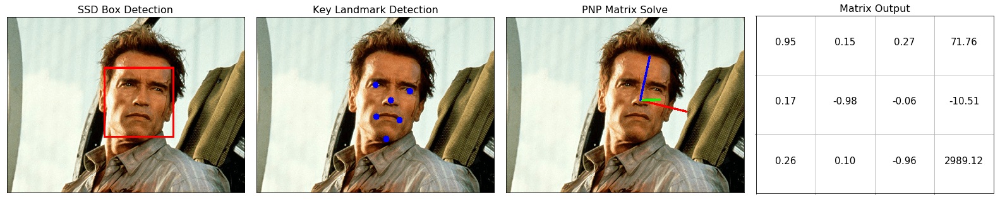

# Realtime-Head-Pose-Open-CV

This project is a C++ implimentation of realtime headpose tracking using OpenCV and DLIB.

## Interesting Stuff

- The output of the Visual Studio Project is a `DLL`, which can be added to a Unity Project and accessed through C#
- The DLL outputs both the transform matrix of the head, and the pixels of the image
- Runs on a live video stream

## Estimation Pipeline Example

- Uses `cv::dnn` to ro run an `SSD face detection` on the scene
- Feeds the most confident result to `dlib::shape_predictor` to detect 68 landmarks
- 6 Key landmark points are used to estimate a matrix using `cv::solvePnP` and `cv::Rodrigues`

## Code Usage
Usage instructions found here: [user manual page](USAGE.md).

